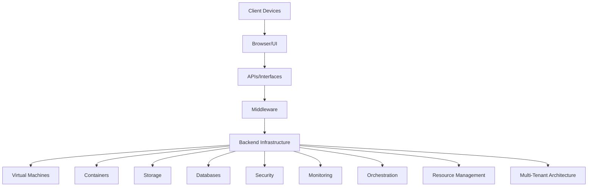

## Cloud Architecture

Cloud architecture defines the **components and subcomponents** needed for cloud computing, including front-end, back-end, network, virtualization, and orchestration layers. It ensures the **delivery of cloud services** like IaaS, PaaS, and SaaS with **scalability, security, and efficiency**.

---

### **1. Frontend (Client-Side)**

| Component        | Description                                                                   |
| ---------------- | ----------------------------------------------------------------------------- |
| Client Devices   | Laptops, desktops, mobiles, thin clients that access cloud services           |
| Web Browser / UI | Interface to interact with cloud applications and services (e.g., dashboards) |
| Client Software  | Installed apps or APIs that connect to cloud services                         |
| Role             | Sends user requests to backend and displays processed results                 |

---

### **2. Backend (Cloud Infrastructure)**

| Component            | Description                                                  |
| -------------------- | ------------------------------------------------------------ |
| Servers              | Hosts virtual machines, containers, and services             |
| Storage              | Provides object, block, or file-based storage solutions      |
| Databases            | Manages persistent and scalable structured/unstructured data |
| Application Services | Includes microservices, APIs, and backend logic              |
| Security Layer       | Ensures identity management, encryption, and access control  |
| Monitoring & Logging | Tracks usage, errors, performance, and system health         |

---

### **3. Virtualization Layer**

| Component        | Description                                                              |
| ---------------- | ------------------------------------------------------------------------ |
| Hypervisors      | Software that enables multiple OS instances on a single physical machine |
| Virtual Machines | Emulated environments acting as independent servers                      |
| Containers       | Lightweight, OS-level virtualization (e.g., Docker)                      |
| Orchestration    | Manages container lifecycles (e.g., Kubernetes)                          |
| Benefits         | Resource efficiency, isolation, rapid deployment                         |

---

### **4. Middleware**

| Component         | Description                                                            |
| ----------------- | ---------------------------------------------------------------------- |
| Message Brokers   | Handle communication between services (e.g., RabbitMQ, Kafka)          |
| API Gateways      | Route API calls and manage policies (e.g., authentication, throttling) |
| Integration Tools | Ensure services talk across different platforms                        |
| Role              | Acts as glue between front-end and back-end layers                     |

---

### **5. APIs and Interfaces**

| Component   | Description                                                   |
| ----------- | ------------------------------------------------------------- |
| REST APIs   | Web service interfaces using HTTP protocols                   |
| SDKs        | Software Development Kits for interacting with cloud services |
| CLI/Console | Command-line tools and web portals for managing resources     |
| Role        | Enables programmatic control and automation of cloud services |

---

### **6. Resource Management**

| Component           | Description                                                                                  |
| ------------------- | -------------------------------------------------------------------------------------------- |
| Resource Allocation | Distributes cloud resources like CPU, memory, storage, and network bandwidth based on demand |
| Autoscaling         | Automatically adjusts the number of resources based on load (vertical/horizontal scaling)    |
| Load Balancing      | Distributes incoming network traffic across multiple resources or servers                    |
| Capacity Planning   | Forecasts future resource needs to avoid under/over provisioning                             |
| Cost Optimization   | Monitors usage patterns and adjusts resources to minimize costs                              |
| Role                | Ensures efficient and cost-effective utilization of cloud resources                          |

---

### **7. Multi-Tenant Architecture**

| Component        | Description                                                                                  |
| ---------------- | -------------------------------------------------------------------------------------------- |
| Tenant Isolation | Ensures that each tenant’s data and workloads are separated securely                         |
| Shared Resources | Multiple tenants share the same physical infrastructure, but their environments are isolated |
| Scalability      | Allows cloud services to scale based on the needs of different tenants                       |
| Cost Efficiency  | Shared resources reduce costs for tenants, as they are pooled and managed centrally          |
| Role             | Ensures efficient use of resources while maintaining security and performance across tenants |

---

### Diagram (Text Representation)

---

### Summary Table

| Layer               | Key Components                           | Purpose                                            |
| ------------------- | ---------------------------------------- | -------------------------------------------------- |
| Frontend            | Browser, UI, Client software             | User interface and interaction                     |
| Backend             | Servers, storage, databases, services    | Core processing and storage                        |
| Virtualization      | Hypervisors, VMs, containers             | Resource efficiency and abstraction                |
| Middleware          | Messaging, APIs, service buses           | Integration between frontend/backend               |
| Interfaces          | APIs, SDKs, CLI                          | Communication with cloud resources                 |
| Resource Management | Allocation, Autoscaling, Load Balancing  | Efficient and cost-effective resource usage        |
| Multi-Tenant        | Isolation, Shared Resources, Scalability | Supporting multiple users securely and efficiently |

---
